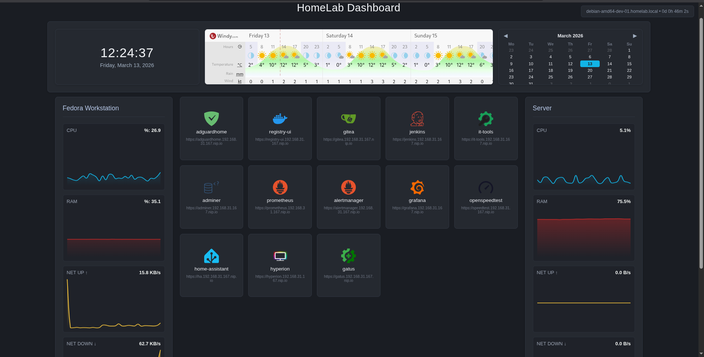

# Homelab Infrastructure Platform

What started as a simple Ansible bootstrap for my homelab gradually evolved into a fully automated infrastructure platform.

The platform provisions and operates a complete self-hosted environment using Infrastructure as Code, integrating containerized service stacks, automated ingress, observability, backup pipelines, and secret management into a unified automation layer.

## Table of Contents

- [Key Features](#key-features)
- [Technology Stack](#technology-stack)
- [Repository Structure](#repository-structure)
- [Design Principles](#design-principles)
- [Architecture Overview](#architecture-overview)
- [Configuration Model](#configuration-model)
- [Deployment](#deployment)
- [Documentation](#documentation)

---

## Key Features

- Infrastructure as Code with Ansible
- Docker service stacks rendered and deployed through a reusable orchestration framework
- Provider-agnostic secret management with runtime injection
- Ingress layer that generates reverse proxy routes, authentication policies, and a custom service dashboard
- Containerized observability stack with metrics, logs, and alerting
- Service-scoped backup and restore pipelines with pluggable encryption and provider-agnostic storage
- Full environment reconstruction from a clean host using automation and remote backups

Example of the generated **service dashboard UI** (auto-generated from `ingress_services`): 

<p align="center">
  
</p>

## Technology Stack

Core technologies powering the platform:

| Category | Technologies |
|--------|-------------|
| Automation | Ansible |
| Container Runtime | Docker, Docker Compose |
| Secrets Management | Bitwarden Secrets Manager |
| Ingress & Access | Nginx, Authelia |
| Secure Networking | Tailscale |
| DNS & Network Services | AdGuard Home |
| Observability | Prometheus, Grafana, Loki, Alertmanager |
| Metrics & Exporters | Node Exporter, cAdvisor, Promtail, PostgreSQL Exporter, AdGuard Exporter |
| Health & Network Diagnostics | Gatus, Healthchecks.io, OpenSpeedTest, iPerf3 |
| Data & Storage | PostgreSQL |
| Backup & Data Protection | rclone |
| Developer Platform | Gitea, Jenkins, Docker Registry |
| Database Management | Adminer |
| Home Automation | Home Assistant, Hyperion |
| Internal Platform Tools | Custom Service Dashboard, Dashboard Metrics Agent |

## Repository Structure

```
homelab_Ansible_playbook/
├── ansible.cfg
├── bws_credentials.yml      # external credentials (excluded from version control)
│
├── inventories/             # environment configuration
│   └── debian_homelab/
│       ├── hosts.ini
│       └── group_vars/
│
├── playbooks/               # entrypoint playbooks
│   └── debian_homelab.yml
│
├── roles/                   # infrastructure roles
│   ├── secrets_backend/     # provider-agnostic secret retrieval
│   ├── base_system/         # host initialization
│   ├── user/                # user and permissions setup
│   ├── packages/            # system packages
│   ├── certificates/        # TLS certificate management
│   ├── git/                 # git environment configuration
│   ├── samba/               # network file sharing
│   ├── stacks/              # service stack definitions
│   ├── rclone/              # backup and restore pipelines
│   └── containers/          # container lifecycle management
│
├── callback_plugins/        # custom Ansible callbacks
├── docs/                    # detailed subsystem documentation
└── reports/                 # generated reports / outputs
```

## Design Principles

The platform is built around the following principles:

- **Provider independence** – Secrets, storage backends, and encryption tools are abstracted to avoid ecosystem lock-in.
- **Extensible architecture** – New stacks, secret providers, or encryption tools can be introduced without modifying existing roles.
- **Declarative infrastructure** – All system state is defined through configuration; no manual host configuration is required.
- **Configuration–execution separation** – Infrastructure state is defined through inventory variables while reusable roles implement the operational logic.
- **Modular stack architecture** – Services are organized into reusable stacks that can be independently deployed or reconciled.
- **Operational symmetry** – Critical workflows such as backup and restore follow mirrored pipelines to ensure predictable recovery.
- **Resource-aware design** – Services are selected and optimized to run efficiently on constrained hardware.


## Architecture Overview

The platform follows a modular infrastructure architecture where services are organized into independent stacks.

The platform provisions infrastructure through a staged lifecycle that prepares the host, reconstructs service state, and deploys containerized services.

```
Host
 ├── Secrets Backend (Provider-agnostic)
 │    ├── check
 │    ├── install
 │    ├── fetch
 │    └── build secrets[] dictionary
 │
 ├── Base System
 ├── Packages
 ├── Certificates
 │
 ├── Service Stacks
 │    ├── Initialize docker networks
 │    └── Render compose files / configs
 │          ├── ingress
 │          ├── monitor
 │          ├── database
 │          ├── dev
 │          └── ...
 │
 ├── Backup Pipelines (rclone)
 │    ├── backup
 │    └── restore
 │
 └── Container Deployment
      ├── reconciliation
      ├── deploy
      └── post configuration
```

The process allows a clean system to be rebuilt into a fully operational environment using automation and remote backups.
### Platform Subsystems

Detailed subsystem architecture and design documentation:

| Subsystem | Documentation |
|----------|---------------|
| Secrets Backend | [secrets_backend.md](docs/architecture/secrets_backend.md) |
| Stack Infrastructure | [stacks.md](docs/architecture/stacks.md) |
| Backup & Restore Pipeline | [backup_restore.md](docs/architecture/backup_restore.md) |
| Container Deployment Pipeline | [containers_deployment.md](docs/architecture/containers_deployment.md) |


## Configuration Model

The platform follows a declarative configuration model where infrastructure behavior is defined through structured inventory variables.

All system configuration, service definitions, stack environments, backup policies, and trust settings are described within the Ansible inventory.  
Roles consume these variables to render configuration files, generate service stacks, and orchestrate the infrastructure lifecycle.

```
inventories/
└─ debian_homelab/
   ├─ hosts.ini
   └─ group_vars/
      └─ all/
         │
         ├─ core/           → host identity and base system configuration
         │   ├─ identity.yml
         │   ├─ system.yml
         │   └─ users.yml
         │
         ├─ services/       → service configuration
         │   ├─ ingress.yml
         │   ├─ database.yml
         │   ├─ monitor.yml
         │   ├─ samba.yml
         │   └─ ...
         │
         ├─ stacks_envs/    → stack runtime variables
         │   ├─ ingress.yml
         │   ├─ dev.yml
         │   ├─ dns.yml
         │   └─ ...
         │
         ├─ backup/         → backup pipeline configuration
         │   ├─ rclone__config.yml
         │   ├─ rclone__backup.yml
         │   └─ rclone__restore.yml
         │
         └─ trust/          → security and trust configuration
             ├─ certificates.yml
             └─ secrets_backend.yml
```

This structure separates configuration into logical domains, allowing infrastructure state and service behavior to be described declaratively while keeping operational logic within the Ansible roles.

## Deployment

The platform is deployed through the main Ansible playbook, which provisions the host, reconstructs service state, and deploys container stacks. Infrastructure can be deployed fully or partially reconciled using role tags.

### Run Full Infrastructure Deployment

```
ansible-playbook playbooks/debian_homelab.yml
```

### Run Specific Playbook Tags

Example: run only the "containers" tag.

```
ansible-playbook playbooks/debian_homelab.yml --tags "containers"
```

### Deploy Specific Stack

```
ansible-playbook playbooks/debian_homelab.yml --tags "containers" -e stacks=monitor
```

Deploy multiple stacks:

```
ansible-playbook playbooks/debian_homelab.yml --tags "containers" -e stacks=["ingress","monitor"]
```

### Force Recreate Stack

```
ansible-playbook playbooks/debian_homelab.yml \
  --tags "containers" \
  -e stacks=["ingress","monitor"] \
  -e force_recreate=true
```

### Run Backup Pipeline

```
ansible-playbook playbooks/debian_homelab.yml \
  --tags "rclone" \
  -e rclone_enable_backup=true
```

### Run Restore Pipeline

```
ansible-playbook playbooks/debian_homelab.yml \
  --tags "rclone" \
  -e rclone_enable_restore=true \
  -e b2_enabled=true \
  -e force_restore_enabled=true
```

## Documentation

Detailed documentation is available in the `docs/` directory.

- [Secrets backend role](docs/roles/secrets_backend_role.md)
- [Stacks role](docs/roles/stacks_role.md)
- [Backup & Restore rclone role ](docs/roles/rclone_role.md)
- [Containers deployment role](docs/roles/containers_deployment_role.md)

