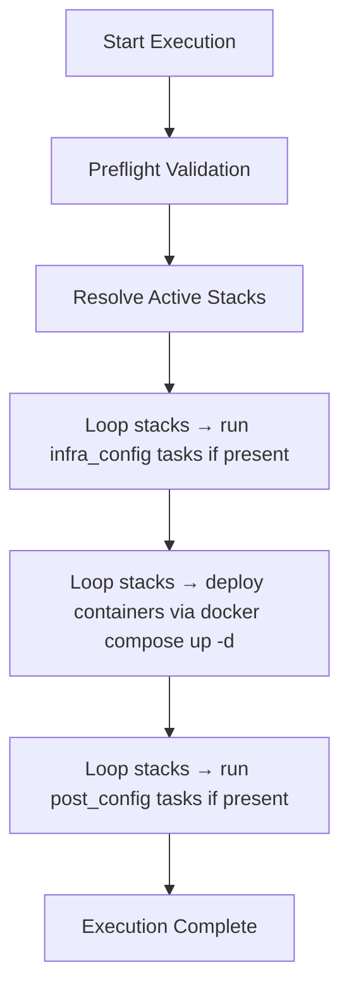

[← Back to README](../../README.md#documentation)

# Containers Role
> Declarative container stack deployment engine for infrastructure services.

The `containers` role provides the runtime execution layer responsible for deploying containerized infrastructure services.

It operates on pre-rendered Docker Compose repositories and performs container lifecycle management in a deterministic and stack-scoped manner.

Service stacks themselves are defined and rendered by the `stacks` role.  
This role executes those stacks by running Docker Compose and handling their deployment lifecycle.

Execution follows a controlled pipeline:

```
preflight → reconcile → deploy → post-configure
```

This architecture separates:

```
Service Definition
vs
Container Runtime Execution
```

allowing stacks to evolve independently while container lifecycle management remains centralized.

---

## Table of Contents

### Architecture
- [Role Architecture](#role-architecture)
- [Design Principles](#design-principles)

### Deployment
- [Stack Activation Model](#stack-activation-model)

### Execution
- [Execution Flow](#execution-flow)

### Runtime
- [Preflight Validation](#preflight-validation)
- [Stack Lifecycle Hooks](#stack-lifecycle-hooks)
- [Force Recreation](#force-recreation)

---

# Role Architecture

The role establishes a clear boundary between **service architecture** and **container runtime execution**.

Stacks define:

- container images
- configuration templates
- environment variables
- networks
- volumes

The containers role performs only the runtime execution of those definitions.

This separation ensures that stack definitions remain independent from the container deployment engine.

---

# Design Principles

- Deterministic stack-based deployment
- Docker Compose as runtime execution engine
- Declarative stack activation
- Hook-based stack lifecycle extensions
- Separation of service definition and runtime execution

The role acts as a **container deployment engine**, not a service definition system.

---

# Stack Activation Model

Active stacks are defined through the `containers` configuration model.

Example:

```yaml
containers:
  base_dir: /srv/containers
  data_dir: /srv/docker-data
  enabled:
    - database
    - ingress
    - dns
    - dev
    - ...
```

Stacks can be selectively deployed at runtime by overriding the stack list.

Examples:

```
ansible-playbook playbooks/debian_homelab.yml \
  --tags "containers" \
  -e stacks=ingress \
```

or

```
ansible-playbook playbooks/debian_homelab.yml \
  --tags "containers" \
  -e stacks=["ingress","monitor"] \
```

If no override is provided, the role deploys all stacks defined in `containers.enabled`.

---

# Execution Flow

Container deployment executes as a deterministic loop across all active stacks.



Each stack repository is located under:

```
{{ containers.base_dir }}/<stack>
```

Docker Compose is executed inside the stack directory to reconcile container state.

This allows each stack to be deployed independently while maintaining a consistent deployment lifecycle.

---

# Preflight Validation

Before deployment begins, the role validates that the runtime environment is correctly prepared.

The following checks are performed:

- `primary_user` variable is defined
- the primary user exists on the system
- Docker is installed and accessible

If any validation fails, execution is aborted.

These checks ensure container deployment occurs on a properly prepared host.

---

# Stack Lifecycle Hooks

Stacks may optionally define lifecycle hook tasks that extend the deployment process.

These hooks are defined inside the `stacks` role.

```
roles/stacks/<stack>/tasks/infra_config.yml
roles/stacks/<stack>/tasks/post_config.yml
```

During execution, the containers role dynamically checks for the presence of these files.

If a hook file exists, it is executed for that stack.

If the file is not present, the stack is skipped for that phase.

This allows stacks to extend the deployment lifecycle without requiring changes to the containers role.

Two hook phases are supported:

- ### Infrastructure Configuration

    ```
    infra_config.yml
    ```

    Executed before container deployment.

    This stage may perform tasks such as:

    - network initialization
    - directory preparation
    - runtime configuration
-   ### Post Configuration

    ```
    post_config.yml
    ```

    Executed after container deployment.

    This stage allows stacks to perform tasks such as:

    - service initialization
    - application configuration
    - runtime adjustments

Both hooks are optional and stack-scoped.

# Force Recreation

The role supports controlled container recreation through the optional variable:

```
force_recreate
```

It can be used like that:

```
ansible-playbook playbooks/debian_homelab.yml \
  --tags "containers" \
  -e stacks=["ingress","monitor"] \
  -e force_recreate=true
```

When enabled, deployment executes:

```
docker compose up -d --force-recreate
```

This forces recreation of all containers within the stack.

This mechanism allows administrators to perform controlled container resets when required.