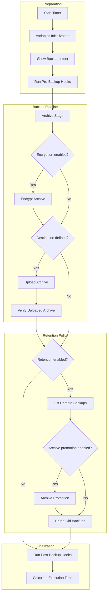
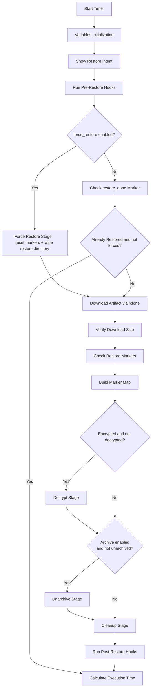

[← Back to README](../../README.md#documentation)

# Rclone Role
> A provider-agnostic, containerized, service-scoped backup and restore orchestration engine built around rclone.

The `rclone` role implements a deterministic, inventory-driven data protection lifecycle for managed hosts.

Backup pipeline:

`archive → encrypt → upload → verify → retention`

Restore pipeline:

`resolve → download → verify → decrypt → extract`

It provides:

- Service-scoped backup and restore definitions
- Stage-based execution pipelines
- Containerized rclone execution (no host-level rclone dependency)
- Remote storage provider agnosticism
- Post-transfer integrity verification
- Policy-driven retention management
- Symmetric restore operations
- Idempotent execution with marker tracking
- Pre/Post lifecycle hooks with container and command support

Backups and restores are defined declaratively under structured data models:

```
rclone_backups
rclone_restores
```

---

## Table of Contents

- [Overview](#overview)
### Architecture
- [Role Architecture](#role-architecture)
- [Design Principles](#design-principles)
- [Storage Abstraction Model](#storage-abstraction-model)
- [Execution Scope](#execution-scope)

### Backup
- [Backup Definition Model](#backup-definition-model)
- [Backup Execution Flow](#backup-execution-flow)

### Restore
- [Restore Definition Model](#restore-definition-model)
- [Restore Execution Flow](#restore-execution-flow)
- [Restore Idempotency Model](#restore-idempotency-model)

### Advanced
- [Backup ↔ Restore Symmetry](#backup--restore-symmetry)
- [Encryption Abstraction](#encryption-abstraction)
- [Retention & Archival Strategy](#retention--archival-strategy)
- [Hooks & Service Integration](#hooks--service-integration)
- [Architectural Impact](#architectural-impact)

---

## Overview

Each service definition describes:

- Source paths
- Remote destinations
- Encryption policy
- Retention strategy
- Restore selection mode (`latest`, `oldest`, specific filename)
- Hook configuration
- Force-restore behavior

Execution follows strict stage-based pipelines.

Backup stages:

- Archive
- Encrypt
- Upload (via containerized rclone)
- Verify (local ↔ remote size validation)
- Retention

Restore stages:

- Resolve artifact
- Download (via containerized rclone)
- Verify
- Decrypt
- Extract
- Cleanup

All remote transfers are executed through a containerized rclone instance, eliminating host-level rclone dependencies, enabling compatibility with any backend supported by rclone (S3-compatible storage, B2, Mega, and others).

Encryption and decryption are abstracted into interchangeable pipeline stages (e.g., GPG, Picocrypt), allowing additional tools to be added without altering core execution logic.

Restore operations are state-aware and idempotent via execution markers, preventing unintended overwrites unless explicitly forced.

Hooks enable container lifecycle handling and execution of custom command lists before and after both backup and restore phases.

The result is a modular, reversible, and policy-driven data protection layer fully controlled through inventory configuration.

---

## Role Architecture

This role establishes a controlled lifecycle around backup and restore operations.

It separates:

Data protection policy  
from  
Execution mechanics

Infrastructure defines:

- What should be backed up
- Where it should be stored
- How long it should be retained
- Whether encryption is required

The role defines how that lifecycle is executed in a predictable, staged manner.

---

## Design Principles

- Declarative service-based backup definitions
- Deterministic multi-stage execution pipeline
- Strict backup ↔ restore symmetry
- Pluggable encryption abstraction
- Storage backend agnostic (via rclone)
- Retention as first-class policy
- Hook-based extensibility

The role implements a staged backup pipeline,
not a simple `rclone sync` wrapper.

---

## Storage Abstraction Model

All remote operations are performed via `rclone`.

This makes the role storage-provider agnostic.

Any backend supported by rclone can be used, including:

- S3-compatible storage
- Backblaze B2
- Mega.nz
- Google Drive
- Other commercial or self-hosted providers

The role never implements provider-specific logic.  
It relies entirely on `rclone.conf`.

---

## Execution Scope

The role runs on managed hosts.

It performs:

- Local archive generation
- Optional local encryption
- Remote transfer via `rclone`
- Remote retention pruning
- Local restore operations
- Optional service lifecycle handling

No controller-side orchestration is involved.

---

## Backup Definition Model

Backup behavior is defined under:

```
rclone_backups
```

Example:

```yaml
rclone_backups:
  services:
    gitea:
      enabled: true
      source:
        path: "{{ GITEA_DATA_PATH }}"
      destination:
        remote: b2_account
        bucket: Homelab
        path: "dockers-state/gitea"
        artifact_prefix: gitea
      archive:
        tool: tar #zip or tar
      crypto:
        enabled: true
        tool: gpg
        recipient: "{{ gpg_public_key }}"
      hooks:
        container: gitea
      retention:
        enabled: true
        keep_last: 10
        min_keep: 2
        archive:
          enabled: true
          day_of_month: 1
          destination:
            remote: b2_account
            bucket: Homelab
            path: "archives/gitea"
```

### Model Characteristics

Each service defines:

- Source path
- Remote destination
- Encryption policy
- Hook configuration
- Retention policy
- Optional long-term archive strategy

Multiple services can be defined independently.

Each service executes its own isolated pipeline.

---

## Backup Execution Flow



---

## Restore Definition Model

Restore behavior is defined under:

```
rclone_restores
```

Example:

```yaml
rclone_restores:
  services:
    gitea:
      enabled: true
      force_restore: true
      source:
        remote: b2_account
        bucket: Homelab
        path_dir: "archives/gitea/2026"
        #latest or oldest or specif filename
        file: latest 
        artifact_prefix: gitea
      destination:
        # ZIP backups include the parent directory it needs '| dirname'.
        # TAR backups include only the contents. Adjust restore path accordingly.
        path_dir: "{{ GITEA_DATA_PATH }}"
      crypto:
        enabled: true
        tool: gpg
        private_key: "{{ gpg_private_key }}"
      archive:
        enabled: true
        cleanup_archive: true
        cleanup_encrypted: true
      hooks:
        container: gitea
        pre_commands: []
        post_commands: []
```

---

## Restore Execution Flow



---

## Restore Idempotency Model

Restore is state-aware and resumable.

Marker files:

- `.restore_done`
- `.decrypt_done`
- `.unarchive_done`

These markers allow:

- Safe re-execution
- Partial-stage recovery
- Controlled forced restoration

If `force_restore` is enabled, existing state can be overwritten.  
Otherwise, previously restored services are skipped.

---

## Backup ↔ Restore Symmetry

The role enforces structural symmetry:

| Backup | Restore |
|--------|----------|
| Archive creation | Archive extraction |
| Encryption | Decryption |
| Upload | Download |
| Retention pruning | Artifact resolution |
| Pre hooks | Pre hooks |
| Post hooks | Post hooks |

Encryption configuration is mirrored between both definitions.

This ensures predictable and reversible operations.

---

## Encryption Abstraction

Encryption is optional and defined per service.

Currently supported tools:

- GPG
- Picocrypt

The encryption layer is abstracted from archive and transfer logic.

Adding a new encryption tool requires:

- Implementing encrypt stage
- Implementing decrypt stage
- Selecting via `crypto.tool`

The rest of the pipeline remains unchanged.

This preserves modularity.

---

## Retention & Archival Strategy

Retention operates against the remote backend.

The role:

1. Lists remote artifacts  
2. Applies keep policies  
3. Prunes older backups  
4. Optionally promotes backups into archive destinations  

Retention and archival are policy-driven and inventory-defined.

---

## Hooks & Service Integration

Hooks provide lifecycle extensibility.

Available in both backup and restore:

- Container-aware handling
- Pre-commands
- Post-commands

This enables consistent backups for stateful workloads without modifying the pipeline core.

---

## Architectural Impact

The `rclone` role introduces a structured, reversible, and policy-driven data protection layer.

It provides:

- Deterministic execution stages
- Service-scoped backup definitions
- Encryption abstraction
- Provider-agnostic remote storage
- Declarative retention policies
- Symmetric restore guarantees

The result is a modular and extensible backup architecture fully defined through inventory configuration.