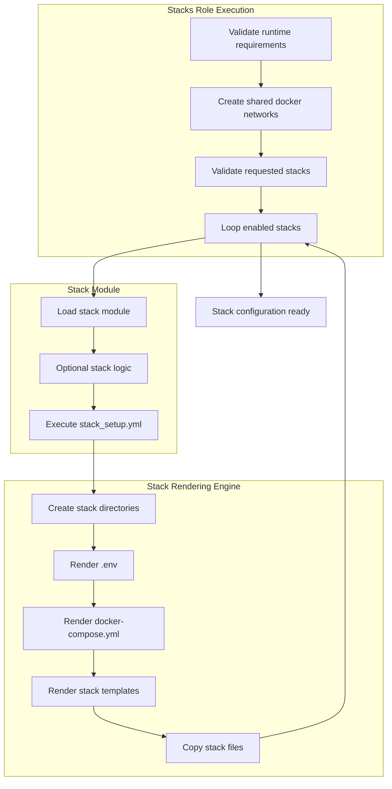

[← Back to README](../../README.md#documentation)

# Stacks Role
> Declarative stack rendering engine for containerized infrastructure services.

The `stacks` role prepares container service stacks by rendering Docker Compose configuration and related service resources from structured templates and inventory-driven configuration.

Each stack is implemented as an isolated module that defines its required directories, templates, and files.  
The role provides a shared rendering framework that materializes those definitions into deterministic stack configuration on the host.

The role acts as a **stack preparation framework**, not a container deployment system.

It does **not deploy containers**.  
It prepares stack configuration so it can later be executed by the container runtime layer.

---

## Table of Contents

### Architecture
- [Role Architecture](#role-architecture)
- [Design Principles](#design-principles)
- [Execution Scope](#execution-scope)

### Stack Model
- [Stack Activation Model](#stack-activation-model)
- [Stack Module Structure](#stack-module-structure)
- [Stack Rendering Engine](#stack-rendering-engine)
- [Stack Configuration Variables](#stack-configuration-variables)

### Execution
- [Execution Flow](#execution-flow)

### Advanced
- [Stack Lifecycle Hooks](#stack-lifecycle-hooks)
- [Architectural Impact](#architectural-impact)

---

# Role Architecture

The role establishes a shared framework for preparing container service stacks.

It separates:

```
Stack Modules
vs
Stack Rendering Framework
```

Each stack module describes the resources required by the service, such as:

- directories
- templates
- configuration files
- Docker Compose definitions

The role provides a centralized rendering pipeline that materializes those definitions on the host.

This allows each service stack to remain self-contained while relying on a common execution framework.

---

# Design Principles

- Declarative stack definitions
- Shared rendering framework
- Modular stack architecture
- Template-driven configuration
- Deterministic stack configuration generation

Stacks describe their required resources while the role performs the rendering operations.

---

# Execution Scope

The role runs on managed hosts.

It performs the following responsibilities:

- validating stack activation
- resolving runtime user identity
- creating shared Docker networks
- rendering Docker Compose configuration
- rendering stack templates
- copying static stack files
- creating required data directories

The role does **not start containers**.

Its responsibility ends once the stack configuration has been rendered and prepared.

---

# Stack Activation Model

Stacks available in the infrastructure are defined through:

```
containers.enabled
```

Example:

```yaml
containers:
  enabled:
    - ingress
    - database
    - dns
    - monitor
```

The role determines which stacks should be prepared through:

```
containers_active
```

This variable allows runtime overrides.

If no override is provided, all stacks listed in `containers.enabled` are prepared.

Before execution begins, the role validates that every requested stack exists in the enabled stack list.

---

# Stack Module Structure

Each stack is implemented as a dedicated module under:

```
roles/stacks/<stack>/
```

Example:

```
roles/stacks/ingress/
roles/stacks/database/
roles/stacks/monitor/
```

A typical stack module contains:

```
tasks/
templates/
files/
handlers/
```

### tasks

Defines how the stack is configured.  
Every stack module invokes the shared rendering framework.

Example:

```
tasks/main.yml
```

### templates

Contains service configuration templates such as:

```
docker-compose.yml.j2
.env templates
service configuration files
```

### files

Optional static files that should be copied as part of the stack configuration.

### handlers

Stack-specific handlers triggered by configuration changes.

Each stack remains isolated while sharing the same rendering framework.

---

# Stack Rendering Engine

All stack modules use the shared rendering engine located at:

```
roles/stacks/tasks/stack_setup.yml
```

This file acts as a reusable stack rendering framework.

Stacks pass configuration variables to this framework, which performs the required operations.

The rendering pipeline performs the following steps:

```
create stack root directory
create stack data directories
render .env file
render docker-compose.yml
render additional templates
copy static files
```

The `.env` file and `docker-compose.yml` are rendered as part of the stack configuration.

Additional templates and copied files are rendered to the destinations defined by the stack module.

---

# Stack Configuration Variables

Stacks define their rendering behavior by passing variables to the shared rendering framework.

Common variables include:

| Variable | Purpose |
|--------|--------|
| `stack_name` | Name of the stack being rendered |
| `stack_env_template` | Environment template for `.env` |
| `stack_compose_template` | Docker Compose template |
| `stack_data_dirs` | Data directories that must exist |
| `stack_templates` | Additional templates to render |
| `stack_file_copies` | Static files to copy |

Example stack module using the rendering framework:

```yaml
- name: Configure monitor stack
  include_tasks: "{{ role_path }}/../tasks/stack_setup.yml"
  vars:
    stack_name: "monitor"

    stack_env_template: "monitor.env.j2"
    stack_compose_template: "docker-compose.yml.j2"

    stack_data_dirs:
      - path: "{{ PROMETHEUS_PATH }}"
        owner: "65534"
        group: "65534"
      - path: "{{ PROMETHEUS_PATH }}/rules"
        owner: "65534"
        group: "65534"
      - path: "{{ ALERTMANAGER_PATH }}"
        owner: "65534"
        group: "65534"
      # additional directories omitted

    stack_templates:
      - src: grafana/grafana.ini.j2
        dest: "{{ GRAFANA_CONFIG_PATH }}/grafana.ini"
        owner: "472"
        group: "472"
        mode: "0640"
        notify: restart grafana
      - src: prometheus/prometheus.yml.j2
        dest: "{{ PROMETHEUS_PATH }}/prometheus.yml"
        notify: restart prometheus

    stack_file_copies:
      - src: grafana/dashboards/
        dest: "{{ GRAFANA_DASHBOARDS_PATH }}/"
        owner: "472"
        group: "472"
        mode: "0644"
        notify: restart grafana
      - src: prometheus/rules/
        dest: "{{ PROMETHEUS_PATH }}/rules/"
        mode: "0644"
        notify: restart prometheus
```

These definitions act as the input to the stack rendering engine.

---

# Execution Flow

Stack preparation follows a deterministic execution pipeline.



Each stack module is executed independently during the stack loop.

---

# Stack Lifecycle Hooks

Stacks may optionally define lifecycle tasks inside their module.

Supported hook files:

```
tasks/infra_config.yml
tasks/post_config.yml
```

These tasks allow stacks to perform infrastructure preparation or service configuration.

- `infra_config.yml` is responsible for **reconciliation tasks** required before container deployment.
- `post_config.yml` is responsible for **post-deployment configuration** of the stack once containers are running.

The execution of these hooks is handled by the container runtime role during stack deployment.

If a hook file exists for a stack, it is executed as part of that lifecycle.

If the file does not exist, the phase is skipped for that stack.

This allows stacks to extend their behavior without modifying the rendering framework.

---

# Architectural Impact

The `stacks` role introduces a modular framework for preparing container service stacks.

It provides:

- reusable stack rendering logic
- modular service stack architecture
- template-driven configuration
- deterministic stack configuration generation

By separating stack preparation from container runtime execution, infrastructure services remain modular while sharing a consistent preparation framework.